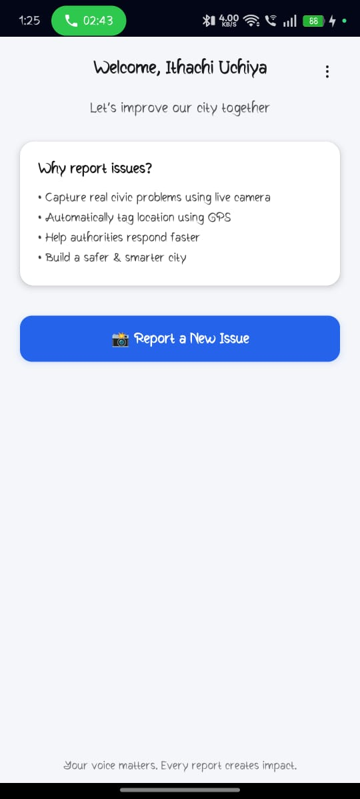
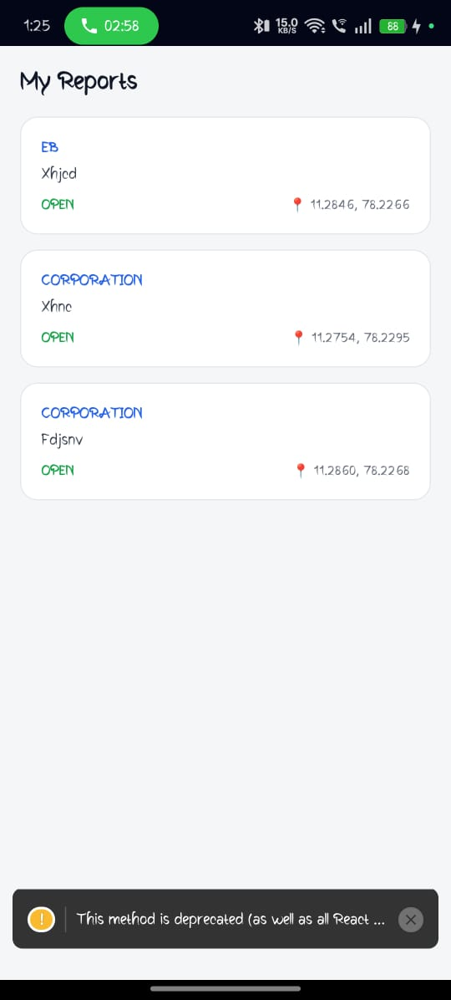
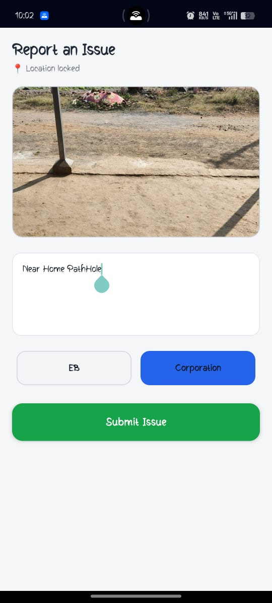

🌍 GeoTech – Geo-Tagged Waste Reporting App

GeoTech is a React Native mobile application that enables citizens to report illegal waste dumping using geo-tagged images and real-time location data, helping authorities take faster and more effective action for cleaner cities.

📌 Problem Statement

Illegal waste dumping is difficult to monitor due to manual complaint systems and lack of accurate location data.
This leads to delayed responses, poor accountability, and environmental pollution.

💡 Solution Overview

GeoTech provides a digital civic platform where users can instantly report waste issues with photos and GPS location, while authorities can verify, track, and resolve issues through a centralized system.

✨ Key Features

Google Sign-In using Firebase Authentication

Geo-tagged waste issue reporting

Image upload for visual evidence

Automatic GPS location capture

Real-time issue submission

Admin verification and status updates

Transparent issue tracking for users

Secure cloud-based data storage

🔧 Technology Stack
📱 Frontend

React Native

⚙️ Backend

Spring Boot (REST APIs)

☁️ Google & Cloud Services

Firebase Authentication

Firebase Firestore / Realtime Database

Firebase Cloud Storage

Google Maps API

Google Location Services

🔄 Application Workflow

User logs in using Google Sign-In

User captures an image of the waste

App automatically captures GPS location

Issue is submitted to the backend

Admin verifies the issue

Status is updated (Open → Verified → Resolved)

User tracks the issue status in real time

🖼️ Screenshots

🎥 Application Workflow Demo

Click the image below to watch the demo video:
[▶️ Click here to watch the demo video](src/assets/demo/App_Demo.mp4)
